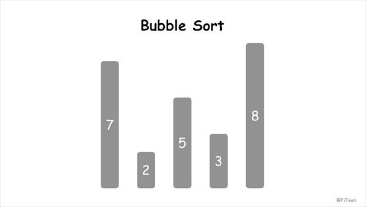

## 冒泡排序

冒泡排序（Bubble Sort），顾名思义，就是指越小的元素会经由交换慢慢“浮”到数列的顶端。

### 算法原理

1. 从左到右，依次比较相邻的元素大小，更大的元素交换到右边；
2. 从第一组相邻元素比较到最后一组相邻元素，这一步结束最后一个元素必然是参与比较的元素中最大的元素；
3. 按照大的居右原则，重新从左到后比较，前一轮中得到的最后一个元素不参与比较，得出新一轮的最大元素；
4. 按照上述规则，每一轮结束会减少一个元素参与比较，直到没有任何一组元素需要比较。

### 动图演示



### 代码实现

#### C语言
```c
void bubble_sort(int arr[], int n) {
    int i, j, tmp;
    for (i = 0; i < n - 1; i++) {
        for (j = 0; j < n - i - 1; j++) {
            if (arr[j] > arr[j + 1]) {
                tmp = arr[j];
                arr[j] = arr[j + 1];
                arr[j + 1] = tmp; 
            }
        }
    }
}
```
### 算法分析

冒泡排序属于**交换排序**，是**稳定排序**，平均时间复杂度为 O(n²)，空间复杂度为 O(1)。

但是我们常看到冒泡排序的**最优时间复杂度是 O(n)**，那要如何优化呢？

我们可以用一个 `flag` 参数记录新一轮的排序中元素是否做过交换，如果没有，说明前面参与比较过的元素已经是正序，那就没必要再从头比较了。代码实现如下：

```c
void bubble_sort_quicker(int arr[], int n) {
    int i, j, tmp, flag;
    for (i = 0; i < n - 1; i++) {
        flag = 0;
        for (j = 0; j < n - i - 1; j++) {
            if (arr[j] > arr[j + 1]) {
                tmp = arr[j];
                arr[j] = arr[j + 1];
                arr[j + 1] = tmp;
                flag = 1;
            }
        }
        if (!flag) return;
    }
}
```
