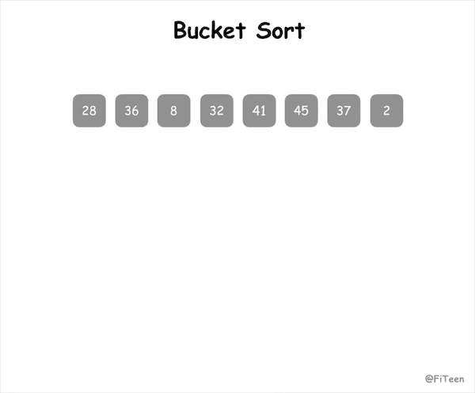

## 桶排序

桶排序（Bucket sort）是[计数排序](../CountingSort)的升级版。它利用了函数的映射关系，高效与否的关键就在于这个映射函数的确定。

桶排序的工作的原理：假设输入数据服从均匀分布，将数据分到有限数量的桶里，每个桶再分别排序（也有可能是使用别的排序算法或是以递归方式继续用桶排序进行排序）。

### 算法步骤

1. 设置固定数量的空桶；
2. 把数据放在对应的桶内；
3. 分别对每个非空桶内数据进行排序；
4. 拼接非空的桶内数据，得到最终的结果。

### 动图演示



### 代码实现

#### C语言
```c
void bucket_sort(int arr[], int n, int r) {
    if (arr == NULL || r < 1) return;

    // 根据最大/最小元素和桶数量，计算出每个桶对应的元素范围
    int max = arr[0], min = arr[0];
    int i, j;
    for (i = 1; i < n; i++) {
        if (max < arr[i]) max = arr[i];
        if (min > arr[i]) min = arr[i];
    }
    int range = (max - min + 1) / r + 1;

    // 建立桶对应的二维数组，一个桶里最多可能出现 n 个元素
    int buckets[r][n];
    memset(buckets, 0, sizeof(buckets));
    int counts[r];
    memset(counts, 0, sizeof(counts));
    for (i = 0; i < n; i++) {
        int k = (arr[i] - min) / range;
        buckets[k][counts[k]++] = arr[i];
    }

    int index = 0;
    for (i = 0; i < r; i++) {
        // 分别对每个非空桶内数据进行排序，比如计数排序
        if (counts[i] == 0) continue;
        counting_sort(buckets[i], counts[i]);
        // 拼接非空的桶内数据，得到最终的结果
        for (j = 0; j < counts[i]; j++) {
            arr[index++] = buckets[i][j];
        }
    }
}
```
### 算法分析

桶排序是**稳定排序**，但仅限于桶排序本身，假如桶内排序采用了快速排序之类的非稳定排序，那么就是不稳定的。

#### 时间复杂度

桶排序的时间复杂度可以这样看：
- n 次循环，每个数据装入桶
- r 次循环，每个桶中的数据进行排序（每个桶中平均有 n/m 个数据）

假如桶内排序用的是选择排序这类时间复杂度较高的排序，整个桶排序的时间复杂度就是 O(n)+O(n²)，视作 O(n²)，这是最差的情况；
假如桶内排序用的是比较先进的排序算法，时间复杂度为 O(nlogn)，那么整个桶排序的时间复杂度为 O(n)+O(r\*(n/r)\*log(n/r))=O(n+nlog(n/r))。k=nlog(n/r)，桶排序的平均时间复杂度为 O(n+k)。当 r 接近于 n 时，k 趋近于 0，这时桶排序的时间复杂度是最优的，就可以认为是 O(n)。也就是说如果数据被分配到同一个桶中，排序效率最低；但如果数据可以均匀分配到每一个桶中，时间效率最高，可以线性时间运行。但同样地，桶越多，空间就越大。

#### 空间复杂度

占用额外内存，需要创建 r 个桶的额外空间，以及 n 个元素的额外空间，所以桶排序的空间复杂度为 O(n+r)。
