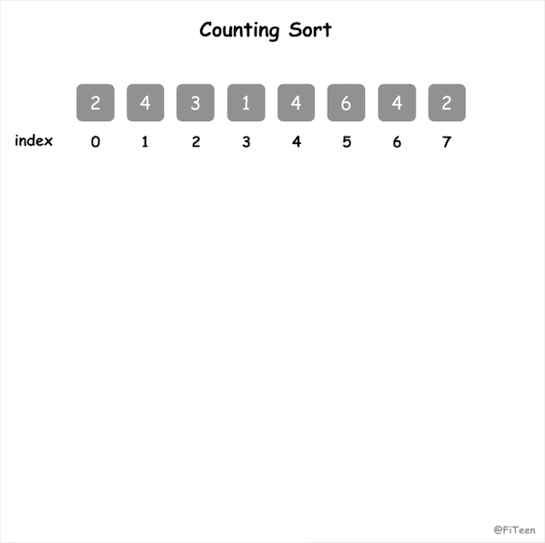

## 计数排序

计数排序（Counting Sort）是一种**非比较性质**的排序算法，利用了**桶**的思想。它的核心在于将**输入的数据值转化为键存储在额外开辟的辅助空间中**，也就是说这个辅助空间的长度取决于待排序列中的数据范围。

如何转化成桶思想来理解呢？我们设立 r 个桶，桶的键值分别对应从序列最小值升序到最大值的所有数值。接着，按照键值，依次把元素放进对应的桶中，然后统计出每个桶中分别有多少元素，再通过对桶内数据的计算，即可确定每一个元素最终的位置。

### 算法步骤

1. 找出待排序列中最大值 max 和最小值 min，算出序列的数据范围 r = max - min + 1，申请辅助空间 C[r]；
2. 遍历待排序列，统计序列中每个值为 i 的元素出现的次数，记录在辅助空间的第 i 位；
3. 对辅助空间内的数据进行计算（从空间中的第一个元素开始，每一项和前一项相加），以确定值为 i 的元素在数组中出现的位置；
4. 反向填充目标数组：将每个元素 i 放在目标数组的第 C[i] 位，每放一个元素就将 C[i] 减1，直到 C 中所有值都是 0

### 动图演示



### 代码实现

#### C语言
```c
void counting_sort(int arr[], int n) {
    if (arr == NULL) return;
    // 定义辅助空间并初始化
    int max = arr[0], min = arr[0];
    int i;
    for (i = 1; i < n; i++) {
        if (max < arr[i]) max = arr[i];
        if (min > arr[i]) min = arr[i];
    }
    int r = max - min + 1;
    int C[r];
    memset(C, 0, sizeof(C));
    // 定义目标数组
    int R[n];
    // 统计每个元素出现的次数
    for (i = 0; i < n; i++) C[arr[i] - min]++;
    // 对辅助空间内数据进行计算
    for (i = 1; i < r; i++) C[i] += C[i - 1];
    // 反向填充目标数组
    for (i = n - 1; i >= 0; i--) R[--C[arr[i] - min]] = arr[i];
    // 目标数组里的结果重新赋值给 arr
    for (i = 0; i < n; i++) arr[i] = R[i];
}
```
### 算法分析

计数排序属于**非交换排序**，是**稳定排序**，适合数据范围不显著大于数据数量的序列。

#### 时间复杂度

它的时间复杂度是线性的，为 O(n+r)，r 表示待排序列中的数据范围，也就是桶的个数。可以这样理解：将 n 个数据依次放进对应的桶中，再从 r 个桶中把数据按顺序取出来。

#### 空间复杂度

占用额外内存，还需要 r 个桶，因此空间复杂度是 O(n+r)，计数排序快于任何比较排序算法，但这是通过牺牲空间换取时间来实现的。
