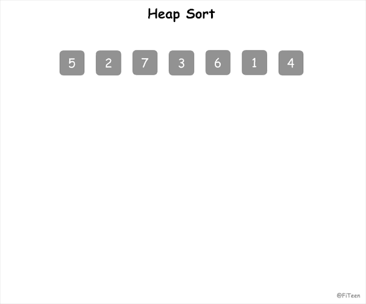

## 堆排序

堆排序（Heap Sort）是指利用堆这种数据结构所设计的一种排序算法。堆的特点：

- 一颗完全二叉树（也就是会所生成节点的顺序是：从上往下、从左往右）
- 每一个节点必须满足父节点的值不大于/不小于子节点的值

### 基本思想

实现堆排序需要解决两个问题：

- 如何将一个无序序列构建成堆？

- 如何在输出堆顶元素后，调整剩余元素成为一个新的堆？

以升序为例，算法实现的思路为：

1. 建立一个 build_heap 函数，将数组 tree[0,...n-1] 建立成堆，n 表示数组长度。函数里需要维护的是所有节点的父节点，最后一个子节点下标为 n-1，那么它对应的父节点下标就是(n-1-1)/2。
2. 构建完一次堆后，最大元素就会被存放在根节点 tree[0]。将 tree[0] 与最后一个元素交换，每一轮通过这种不断将最大元素后移的方式，来实现排序。
3. 而交换后新的根节点可能不满足堆的特点了，因此需要一个调整函数 heapify 来对剩余的数组元素进行最大堆性质的维护。如果 tree[i] 表示其中的某个节点，那么 tree[2\*i+1] 是左孩子，tree[2\*i+2] 是右孩子，选出三者中的最大元素的下标，存放于 max 值中，若 max 不等于 i，则将最大元素交换到 i 下标的位置。但是，此时以 tree[max] 为根节点的子树可能不满足堆的性质，需要递归调用自身。

### 动图演示



### 代码实现

#### C语言

```c
void heapify(int tree[], int n, int i) {
    // n 表示序列长度，i 表示父节点下标
    if (i >= n) return;
    // 左侧子节点下标
    int left = 2 * i + 1;
    // 右侧子节点下标
    int right = 2 * i + 2;
    int max = i;
    if (left < n && tree[left] > tree[max]) max = left;
    if (right < n && tree[right] > tree[max]) max = right;
    if (max != i) {
        swap(tree, max, i);
        heapify(tree, n, max);
    }
}

void build_heap(int tree[], int n) {
    // 树最后一个节点的下标
    int last_node = n - 1;
    // 最后一个节点对应的父节点下标
    int parent = (last_node - 1) / 2;
    int i;
    for (i = parent; i >= 0; i--) {
        heapify(tree, n, i);
    }
}

void heap_sort(int tree[], int n) {
    build_heap(tree, n);
    int i;
    for (i = n - 1; i >= 0; i--) {
        // 将堆顶元素与最后一个元素交换
        swap(tree, i, 0);
        // 调整成大顶堆
        heapify(tree, i, 0);
    }
}
```

### 算法分析

堆排序是**不稳定排序**，适合数据量较大的序列，它的平均时间复杂度为 Ο(nlogn)，空间复杂度为 O(1)。
此外，堆排序仅需一个记录大小供交换用的辅助存储空间。
