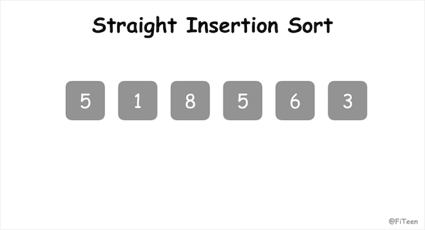

## 插入排序

直接插入排序（Straight Insertion Sort），是一种简单直观的排序算法，它的基本操作是不断地将尚未排好序的数插入到已经排好序的部分，好比打扑克牌时一张张抓牌的动作。在冒泡排序中，经过每一轮的排序处理后，序列后端的数是排好序的；而对于插入排序来说，经过每一轮的排序处理后，序列前端的数都是排好序的。

### 基本思想

先将第一个元素视为一个有序子序列，然后从第二个元素起逐个进行插入，直至整个序列变成元素非递减有序序列为止。如果待插入的元素与有序序列中的某个元素相等，则将待插入元素插入大相等元素的后面。整个排序过程进行 n-1 趟插入。

### 动图演示



### 代码实现

#### C语言


```c
void StraightInsertionSort(int arr[], int len) {
	int i, j, temp;
	for (i = 1; i < len; i++) {
		temp = arr[i];
		for (j = i; j > 0 && arr[j-1] > temp; j--)
			arr[j] = arr[j-1];
		arr[j] = temp;
	}
}
```
### 算法分析

插入排序是稳定排序，平均时间复杂度为 $O(n^2)$，空间复杂度为 $O(1)$。
