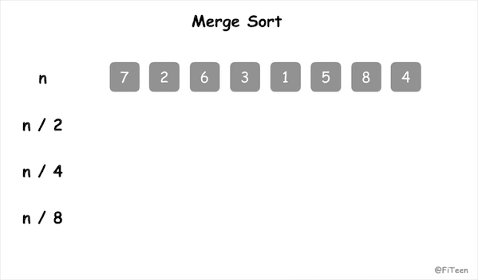

## 归并排序

归并排序（Merge Sort）是建立在**归并**操作上的一种排序算法。它和快速排序一样，采用了**分治法**。

### 基本思想

归并的含义是将两个或两个以上的有序表组合成一个新的有序表。也就是说，从几个数据段中逐个选出最小的元素移入新数据段的末尾，使之有序。

那么归并排序的算法我们可以这样理解：

假如初始序列含有 n 个记录，则可以看成是 n 个有序的子序列，每个子序列的长度为 1。然后两两归并，得到 n/2 个长度为2或1的有序子序列；再两两归并，……，如此重复，直到得到一个长度为 n 的有序序列为止，这种排序方法称为 **二路归并排序**，下文介绍的也是这种排序方式。

### 动图演示



### 代码实现

#### C语言

```c
/* 将 arr[L..M] 和 arr[M+1..R] 归并 */
void merge(int arr[], int L, int M, int R) {
    int LEFT_SIZE = M - L + 1;
    int RIGHT_SIZE = R - M;
    int left[LEFT_SIZE];
    int right[RIGHT_SIZE];
    int i, j, k;
    // 以 M 为分割线，把原数组分成左右子数组
    for (i = L; i <= M; i++) left[i - L] = arr[i];
    for (i = M + 1; i <= R; i++) right[i - M - 1] = arr[i];
    // 再合并成一个有序数组（从两个序列中选出最小值依次插入）
    i = 0; j = 0; k = L;
    while (i < LEFT_SIZE && j < RIGHT_SIZE) arr[k++] = left[i] < right[j] ? left[i++] : right[j++];
    while (i < LEFT_SIZE) arr[k++] = left[i++];
    while (j < RIGHT_SIZE) arr[k++] = right[j++];
}

void merge_sort(int arr[], int L, int R) {
    if (L == R) return;
    // 将 arr[L..R] 平分为 arr[L..M] 和 arr[M+1..R]
    int M = (L + R) / 2;
    // 分别递归地将子序列排序为有序数列
    merge_sort(arr, L, M);
    merge_sort(arr, M + 1, R);
    // 将两个排序后的子序列再归并到 arr
    merge(arr, L, M, R);
}
```

### 算法分析

归并排序是**稳定排序**，它和选择排序一样，性能不受输入数据的影响，但表现比选择排序更好，它的时间复杂度始终为 O(nlogn)，但它需要额外的内存空间，空间复杂度为 O(n)。
