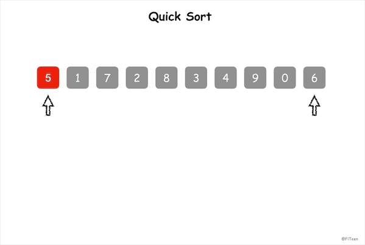

## 快速排序

快速排序（Quick Sort），是冒泡排序的改进版，之所以“快速”，是因为使用了**分治法**。它也属于交换排序，通过元素之间的位置交换来达到排序的目的。

### 基本思想

在序列中随机挑选一个元素作基准，将小于基准的元素放在基准之前，大于基准的元素放在基准之后，再分别对小数区与大数区进行排序。

**一趟快速排序**的具体做法是：

1. 设两个指针 i 和 j，分别指向序列的头部和尾部；
2. 先从 j 所指的位置向前搜索，找到第一个比基准小的值，把它与基准交换位置；
3. 再从 i 所指的位置向后搜索，找到第一个比基准大的值，把它与基准交换位置；
4. 重复 2、3 两步，直到 i = j。

仔细研究一下上述算法我们会发现，在排序过程中，对基准的移动其实是多余的，因为只有一趟排序结束时，也就是 i = j 的位置才是基准的最终位置。

由此可以**优化**一下算法：

1. 设两个指针 i 和 j，分别指向序列的头部和尾部；
2. 先从 j 所指的位置向前搜索，找到第一个比基准小的数值后停下来，再从 i 所指的位置向后搜索，找到第一个比基准大的数值后停下来，把 i 和 j 指向的两个值交换位置；
3. 重复步骤2，直到 i = j，最后将相遇点指向的值与基准交换位置。

### 动图演示



### 代码实现

#### C语言

这里取序列的第一个元素为基准。

```c
void swap(int arr[], int i, int j) {
    int temp = arr[i];
    arr[i] = arr[j];
    arr[j] = temp;
}

int SelectPivot(int arr[], int low) {
    return arr[low];
}

void QuickSort(int arr[], int low, int high) {
    int i, j, pivot;
    if (low >= high) return;
    pivot = SelectPivot(arr, low, high);
    i = low;
    j = high;
    while (i < j) {
	while (arr[j] >= pivot && i < j) j--;
	while (arr[i] <= pivot && i < j) i++;
	if (i < j) {
	    swap(arr, i, j);
	}
    }
    arr[low] = arr[i];
    arr[i] = pivot;
    QuickSort(arr, low, i - 1);
    QuickSort(arr, i + 1, high);
}
```
### 算法分析

快速排序是不稳定排序，它的平均时间复杂度为 $O(nlog_2n)$，平均空间复杂度为 $O(log_2n)$。

快速排序中，基准的选取非常重要，它将影响排序的效率。举个例子，假如序列本身顺序随机，快速排序是所有同数量级时间复杂度的排序算法中平均性能最好的，但如果序列本身已经有序或基本有序，直接**选取固定位置，例如第一个元素**作为基准，会使快速排序就会沦为冒泡排序，时间复杂度为 $O(n^2)$。为了避免发生这种情况，引入下面两种获取基准的方法：

**随机选取**

就是选取序列中的任意一个数为基准的值。

```c
int SelectPivotRandom(int arr[], int low, int high) {
    srand((unsigned)time(NULL));
    int pivot = rand()%(high - low) + low;
    swap(arr, pivot, low);
    return arr[low];
}
```

**三者取中**

就是取起始位置、中间位置、末尾位置指向的元素，对这三个元素排序后取中间数作为基准。

```c
int SelectPivotMedianOfThree(int arr[], int low, int high) {
    // 计算数组中间的元素的下标
    int mid = low + ((high - low) >> 1);
    // 排序，使 arr[mid] <= arr[low] <= arr[high]
    if (arr[mid] > arr[high]) {
        swap(arr, mid, high);
    }
    if (arr[low] > arr[high]) {
        swap(arr, low, high);
    }
    if (arr[mid] > arr[low]) {
	swap(arr, low, mid);
    }
    // 使用 low 位置的元素作为基准
    return arr[low];
}
```

经验证明，三者取中的规则可以大大改善快速排序在最坏情况下的性能。
