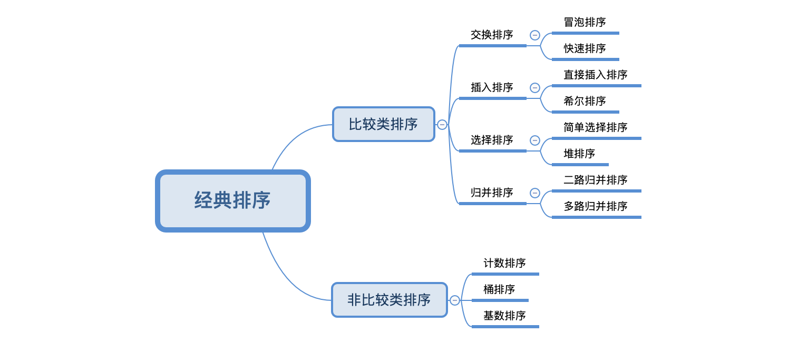

# 经典排序算法动画与解析

排序算法是程序员必备的基础知识，弄明白它们的原理和实现很有必要。

我们可以将常见的排序算法可以分成两类：

**比较类排序**：通过比较来决定元素间的相对次序，时间复杂度为 $O(nlog_2n)～O(n^2)$。属于比较类的有：

- [冒泡排序](BubbleSort)
- 快速排序
- 插入排序
- 希尔排序
- 选择排序
- 堆排序
- 归并排序

**非比较类排序**：不通过比较来决定元素间的相对次序，其时间复杂度可以突破  $O(nlog_2n)$，以线性时间运行。属于非比较类的有：

- 计数排序
- 桶排序
- 基数排序