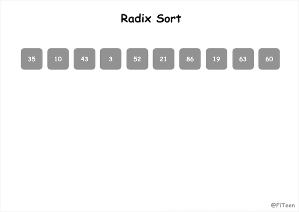

## 基数排序

基数排序（Radix Sort）是**非比较型**排序算法，它和[计数排序](../CountingSort)、[桶排序](../BucketSort)一样，利用了“**桶**”的概念。基数排序不需要进行记录关键字间的比较，是一种**借助多关键字排序的思想对单逻辑关键字进行排序**的方法。比如数字100，它的个位、十位、百位就是不同的关键字。

那么，对于一组乱序的数字，基数排序的实现原理就是将整数按位数（关键字）切割成不同的数字，然后按每个位数分别比较。对于关键字的选择，有最高位优先法（MSD法）和最低位优先法（LSD法）两种方式。MSD 必须将序列先逐层分割成若干子序列，然后再对各子序列进行排序；而 LSD 进行排序时，不必分成子序列，对每个关键字都是整个序列参加排序。

### 算法步骤

以 LSD 法为例：
1. 将所有待比较数值（非负整数）统一为同样的数位长度，数位不足的数值前面补零
2. 从最低位（个位）开始，依次进行一次排序
3. 从最低位排序一直到最高位排序完成以后, 数列就变成一个有序序列

如果要支持负数参加排序，可以将序列中所有的值加上一个常数，使这些值都成为非负数，排好序后，所有的值再减去这个常数。

### 动图演示



### 代码实现

#### C语言
```c
// 基数，范围0~9
#define RADIX 10

void radix_sort(int arr[], int n) {
    // 获取最大值和最小值
    int max = arr[0], min = arr[0];
    int i, j, l;
    for (i = 1; i < n; i++) {
        if (max < arr[i]) max = arr[i];
        if (min > arr[i]) min = arr[i];
    }
    // 假如序列中有负数，所有数加上一个常数，使序列中所有值变成正数
    if (min < 0) {
        for (i = 0; i < n; i++) arr[i] -= min;
        max -= min;
    }
    // 获取最大值位数
    int d = 0;
    while (max > 0) {
        max /= RADIX;
        d ++;
    }
    int queue[RADIX][n];
    memset(queue, 0, sizeof(queue));
    int count[RADIX] = {0};
    for (i = 0; i < d; i++) {
        // 分配数据
        for (j = 0; j < n; j++) {
            int key = arr[j] % (int)pow(RADIX, i + 1) / (int)pow(RADIX, i);
            queue[key][count[key]++] = arr[j];
        }
        // 收集数据
        int c = 0;
        for (j = 0; j < RADIX; j++) {
            for (l = 0; l < count[j]; l++) {
                arr[c++] = queue[j][l];
                queue[j][l] = 0;
            }
            count[j] = 0;
        }
    }
    // 假如序列中有负数，收集排序结果时再减去前面加上的常数
    if (min < 0) {
        for (i = 0; i < n; i++) arr[i] += min;
    }
}
```

### 算法分析

基数排序是**稳定排序**，适用于关键字取值范围固定的排序。

#### 时间复杂度

基数排序可以看作是若干次“分配”和“收集”的过程。假设给定 n 个数，它的最高位数是 d，基数（也就是桶的个数）为 r，那么可以这样理解：共进行 d 趟排序，每趟排序都要对 n 个数据进行分配，再从 r 个桶中收集回来。所以算法的时间复杂度为 O(d(n+r))，在整数的排序中，r = 10，因此可以简化成 O(dn)，是**线性阶**的排序。

#### 空间复杂度

占用额外内存，还需要 r 个桶，所以空间复杂度为 O(n+r)。

### 计数排序 & 桶排序 & 基数排序

这三种排序算法都利用了桶的概念，但对桶的使用方法上有明显差异：

- 桶排序：每个桶存储一定范围的数值，适用于元素尽可能分布均匀的排序；
- 计数排序：每个桶只存储单一键值，适用于最大值和最小值尽可能接近的排序；
- 基数排序：根据键值的每位数字来分配桶，适用于非负整数间的排序，且最大值和最小值尽可能接近。