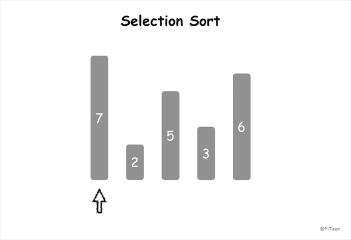

## 选择排序

选择排序（Selection Sort）是一种简单直观的排序算法。它的基本思想就是，每一趟 n-i+1(i=1,2,...,n-1)个记录中选取关键字最小的记录作为有序序列的第 i 个记录。

### 算法步骤

**简单选择排序**：

1. 在未排序序列中找到最小（大）元素，存放到排序序列的起始位置;
2. 在剩余未排序元素中继续寻找最小（大）元素，放到已排序序列的末尾;
3. 重复步骤2，直到所有元素排序完毕。

### 动图演示



### 代码实现

#### C语言

```c
void selection_sort(int arr[], int len) {
    int i, j;
    for (i = 0; i < len - 1; i++) {
        int min = i;
        for (j = i + 1; j < len; j++) {
            if (arr[j] < arr[min])
                min = j;
        }
        swap(arr, min, i);
    }
}
```


### 算法分析

选择排序是**不稳定排序**，时间复杂度固定为 O(n²)，因此它不适用于数据规模较大的序列。不过它也有优点，就是不占用额外的内存空间。
