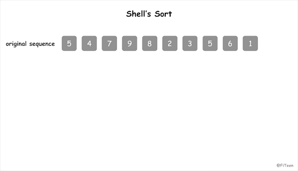

## 希尔排序

希尔排序（Shell's Sort）是第一个突破 O(n²) 的排序算法，是直接插入排序的改进版，又称“**缩小增量排序**”（Diminishing Increment Sort）。它与直接插入排序不同之处在于，它会优先比较距离较远的元素。

### 基本思想

先将整个待排序列分割成若干个字序列分别进行直接插入排序，待整个序列中的记录“基本有序”时，再对全体记录进行一次直接插入排序。

子序列的构成不是简单地“逐段分割”，将相隔某个增量的记录组成一个子序列，让增量逐趟缩短，直到增量为 1 为止。

### 动图演示



### 代码实现

#### C语言

增量序列可以有各种取法，例如上面动图所示，增量序列满足 [n / 2, n / 2 / 2, ..., 1]，n 是序列本身的长度，这也是一种比较流行的增量序列定义方式。这时希尔排序的算法可以通过下面的代码实现：

```c
void shell_sort_split_half(int arr[], int n) {
    int i, j, dk, temp;
    for (dk = n >> 1; dk > 0; dk = dk >> 1) {
        for (i = dk; i < n; i++) {
            temp = arr[i];
            for (j = i - dk; j >= 0 && arr[j] > temp; j -= dk)
                arr[j + dk] = arr[j];
            arr[j + dk] = temp;
        }
    }
}
```

增量序列也可以有其它的定义方式，那么希尔排序的实现可以归纳成这样：

```c
void shell_insert(int arr[], int n, int dk) {
    int i, j, temp;
    for (i = dk; i < n; i += dk) {
        temp = arr[i];
        j = i - dk;
        while (j >= 0 && temp < arr[j]) {
            arr[j + dk] = arr[j];
            j -= dk;
        }
        arr[j + dk] = temp;
    }
}

void shell_sort(int arr[], int n, int dlta[], int t) {
    int k;
    for (k = 0; k < t; ++k) {
        // 一趟增量为 dlta[k] 的插入排序
        shell_insert(arr, n, dlta[k]);
    }
}
```

### 算法分析

希尔排序是**不稳定排序**，它的分析是一个复杂的问题，因为它的运行时间依赖于增量序列的选择，它的平均时间复杂度为O(n^1.3)，最好情况是 O(n)，最差情况是 O(n²)。空间复杂度为 O(1)。
